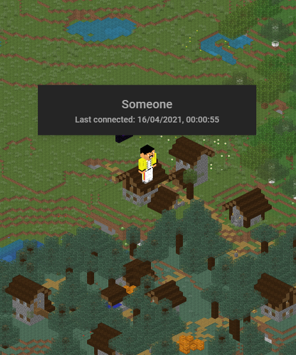

<h1> Minecraft Monitor</h1>

[](https://github.com/domialex/Minecraft-Monitor/releases)
[](https://github.com/domialex/Minecraft-Monitor/releases)

A simple **Minecraft** web map that shows the players' positions in real-time.

Works on **vanilla** or **modded** servers (1.13+).

| Real-time player positions | Player inventories (work in progress) |
| ---|---|
|  |  |

**Minecraft Monitor** gathers the necessary data from a Minecraft server using an RCON connection and shows the players' positions on a map using an existing [Minecraft-Overviewer](http://docs.overviewer.org) configuration.

## Usage
1. Download and extract [**Minecraft Monitor**](https://github.com/domialex/Minecraft-Monitor/releases) somewhere.
2. Configure **appsettings.json** to change the default admin password and the URL you want to bind to your server.
3. Run **Minecraft Monitor.exe** and navigate to the dashboard: http://localhost:5000/dashboard (default url)

*Remember to configure your Minecraft server to accept RCON connections in the **server.properties** file:*
```ini
enable-rcon=true
rcon.port=25575
rcon.password=yourpassword
```

*For internet-facing installations, remember to forward your port to the server.*

*If you're on **Linux**, simply clone the repository, build and run with dotnet CLI.*

## Work in progress
- Add the player's inventories in the popup
- Wrap Overviewer completely for easier setup

## Thanks
- [Minecraft-Overviewer](https://github.com/overviewer/Minecraft-Overviewer)
- [MudBlazor](https://github.com/Garderoben/MudBlazor)
- [RconSharp.NetStandard](https://github.com/wgraham17/rconsharp)
